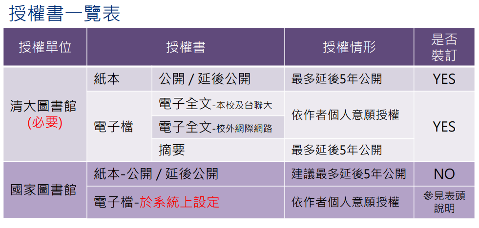
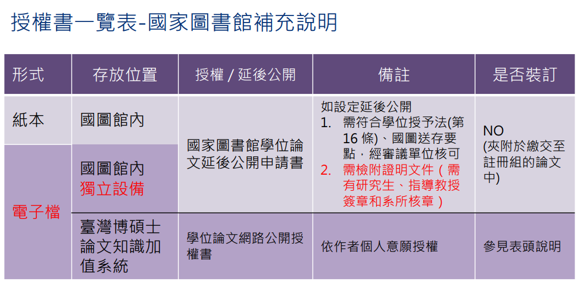

# 離校流程

> - [博碩士論文上傳說明投影片](https://www.lib.nthu.edu.tw/ETD/downloads/upload.pdf)
> - [清大資工離校程序](https://dcs.site.nthu.edu.tw/p/406-1174-5083,r521.php)
> - [碩士班畢業程序](https://github.com/NTHU-LSALAB/NTHU_Master_Degree_Graduation_Process)

## 簡易流程

1. 校務系統 -> 畢業生離校系統 -> 1~4步驟
   - 第四步驟會顯示目前進度
2. 跟老師討論授權相關事情，有需要的話要簽名 (建議國圖和清大一起處理)
3. 碩論上傳至[國立清華大學博碩士論文全文系統](https://etd.lib.nycu.edu.tw/cgi-bin/gs32/hugsweb.cgi?o=dnthucdr)
4. 印刷論文至少三本 (**上傳完才印**)
5. 跑完[實驗室交接單](https://u.pcloud.link/publink/show?code=XZbfux0ZNzQ6aRtyQuheradly9EOzF2thFLX)
6. 填寫系辦[畢業離校確認單](https://dcs.site.nthu.edu.tw/p/423-1174-971.php)和[畢業生問卷](https://www.surveycake.com/s/nZMPQ)
7. 請老師簽系辦離校單
8. 去系辦
   - 繳交離校單
   - 繳交碩論紙本(會幫你包好，要給註冊組的)
9. 去圖書館
   - 繳交碩論紙本
   - 停止借閱書籍空間權限
10. 去註冊組
    - 繳交碩論紙本
    - 領取畢業證書

## 細節補充

授權相關
---
> 授權分成紙本跟電子檔兩部分
> - 紙本: 只能立刻/延後公開，**最多五年**
> - 電子檔: **根據個人意願授權**

### 討論項目
1. 國家圖書館紙本延後公開書
>   - **要教授親筆簽名**
>   - 共指的話，必須兩個都要親簽
2. 清大校內紙本、電子檔授權

討論內容
---
- 是否延後? 
- 延後原因?
- 延後幾年? **(最多五年)**
- 國圖延後公開書要跟老師約在哪裡、幾時簽名?
  - **切記要親筆簽名**

碩士論文上傳
---

1. 將**碩論封面頁的日期改成民國年** (ex: Jul, 2024 -> 民國 113 年 7 月)
2. 將論文pdf檔案加密，並設定成**允許列印，不允許變更，不須密碼開啟**
>   - 可以去圖書館借電腦使用
>   - 或使用 PDF-XChanger Editor
3. 擷取摘要檔
>   - **摘要一樣要加密**
4. 至[國立清華大學博碩士論文系統](https://etd.lib.nycu.edu.tw/cgi-bin/gs32/hugsweb.cgi?o=dnthucdr) -> 上傳論文建檔
>   - 畢業學年度、畢業年同審定書
>   - 出版年則為辦離校的年度
   
5. 上傳**加密過的論文和摘要**
>   - **可以預覽就表示上傳成功**
>   - 系統很常卡住
>   - 卡住SOP: 回到歷史紀錄 -> 點選之前的版本 -> 回到論文系統首頁 -> 登出 -> 重新登入
6. 授權清大紙本與電子檔、國圖電子檔
7. 審核通過後印出授權書
8. 影印論文，至少三本
   - 一本實驗室
   - 一本註冊組
   - 一本圖書館

實驗內部交接單
---

> - ~~最搞的部分~~
> - 請先下載:
>   - [交接單](https://u.pcloud.link/publink/show?code=XZbfux0ZNzQ6aRtyQuheradly9EOzF2thFLX)
>   - [回覆樣板](https://u.pcloud.link/publink/show?code=XZKfXO0ZUg1X9qJHRzJPwmCUWFcwN4jEwULX)
> - 偶爾會改版，自己注意
> - 要把交接單上內容全部跑完，才可以跟老師去找老師簽系上的離校單

1. 完成論文修改並回覆口委問題
2. 取得口委回覆證明
   - 口委回覆證明**只要有寄信即可，寄送之前給老師確認過內容即可**
3. 交接論文及程式碼
4. 最終版本**彩色論文**
5. 確認[通訊資料]( https://reurl.cc/5pGq8z)無誤
6. 實驗室網頁中新增 Project 頁面的資料
   - **CGV 規則不太一樣，東西當年不是丟到google drive上，請跟老師確認一下**
   - code: 上傳 gitlab
   - data: 上傳 NAS
   - 需要請博班幫忙辦帳號
7. 清空個人用品、電腦資料
8. 歸還實驗室借的器材
9. 繳回實驗室鑰匙、領離校同意書
   - 離校同意書其實就是系辦的畢業離校確認單
     - ~~同個東西，不同定義，經典CGV~~
   - 可以電簽
10. ??????

論文繳交
---

> Checklist:
> - [ ] 學生證
> - [ ] 兩本論文
> - [ ] 畢業離校確認單 

1. 填完畢業離校確認單
2. 帶論文、畢業離校確認單去系辦
   - 系辦會把一本論文包好，要給註冊組的
3. 去圖書館繳交論文，順便辦理**停止借閱書籍空間權限**
4. 去註冊組繳交論文、學生證，領取畢業證書