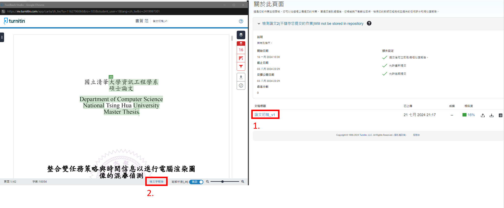
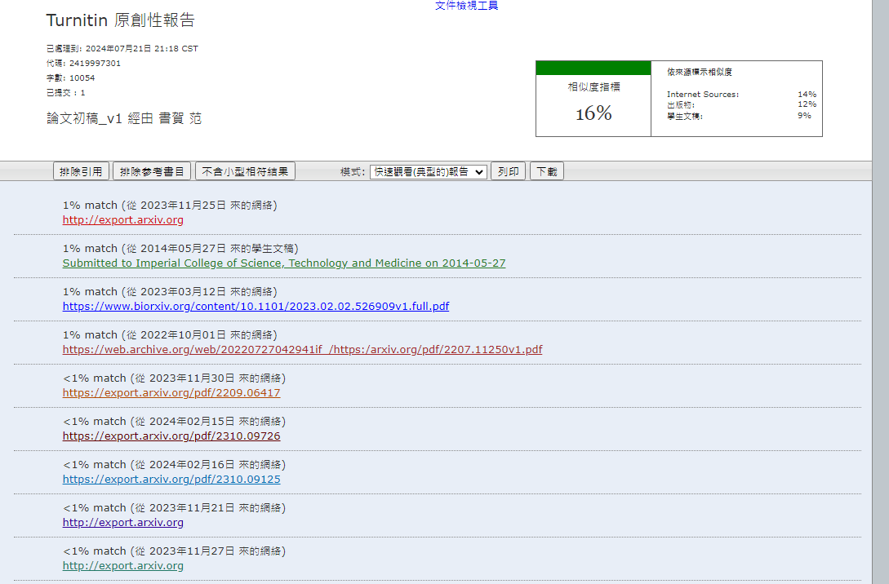

# 口試流程

## 申請前須知

- [ ] 論文題目
> - 選3~5個左右供老師決定
- [ ] 口委名單 (至少3位，且一位校外)
- [ ] 口試具體地點
- [ ] 口試時間
> - 詳見 [信件樣板](./email_template.md)

## 申請流程

- 懶人包: 申請口試 -> 收到申請通過信件 -> 繳交報表1~3至系辦 (不需要簽名) -> 準備口試
- 詳見[碩士學位考試注意事項](https://dcs.site.nthu.edu.tw/p/404-1174-184424.php)
1. 口試申請: 校務資訊系統 -> 研究生學位考試 -> 登錄作業: 輸入論文題目以及口委資料等等
> - 之後會收到系辦寄信通知申請通過
2. 口試相關書: 校務資訊系統 -> 研究生學位考試 -> 報表(1~3): 列印教授推薦書、委員審定書、口試評分單，並**最晚於口試前一周交到系辦**
> - 當天再簽名即可
3. 聘函: 校務資訊系統 -> 研究生學位考試 -> 報表(4): 確認沒問題後，以email寄送聘函(可以cc給自己看看信件有沒有問題)
> 當天印出來再給也可以
4. 學術倫理聲明書: 校務資訊系統 -> 研究生學位考試 -> 報表(5): 列印符合學術倫理聲明書，口試當天給老師簽名
5. 申請完記得寄信邀請口委
> - 形式上走個流程而已
> - 詳見 [信件樣板](./email_template.md)

## 口試資料準備

- [ ] 準備**口試投影片**
> - 以報告30min為準
- [ ] 寫**論文**
> - 請使用overleaf
> - 詳情請參考[overleaf 樣板](./overleaf_template.md)
- [ ] 申請turnitin帳號
> - 至少要一個工作天
> - 跑完報告後印出來口試當天給老師簽名
> - 印來給老師簽名用的就好，數值上不會太嚴格

## 投影片跟論文完成後，口試前

> 所需約一周時間準備，記得互相幫忙，走完最後一哩路

- [ ] 寄送論文以及投影片給口委，並提醒口委口試時間
> - 先跟老師確認
> - 可以寄送google drive資料夾連結，這樣可以之後再更新內容
> - 詳情請參考[信件樣板](./email_template.md)
- [ ] 印出投影片、Turnitin 原創性比對報告
> - 每位口委各一份
> - 投影片可以4頁一張，單面列印，並且確認會不會有動畫遮蔽到圖片
>   - 去邊界tips: 先轉成 PDF，然後印出來設定4頁一張
> - **投影片印彩色的**
> - turnitin詳情參考底下補充內容
- [ ] 每位口委準備一台平板，裡面先放好論文以及投影片
> - 實驗室有5台，確定有充電+資料有放上去
- [ ] 準備點心、飲料、便當、咖啡、水
- [ ] 準備筆電，雷射筆，線上會議連結，測試麥克風
> - 線上會議之前是用teams，然後**記得錄製**
> - 可以問老師確認看看要不要攝影機，之前是不用
- [ ] 穿得像人一點，襯衫長褲、不要穿拖鞋
- [ ] 請一位學弟妹幫忙記錄問題

### Turnitin 原創性比對報告補充

- 比對分數出來後 -> 點開報告 -> 點選**唯文字報告** -> 列印
> - 可以排除引用、參考書目，降低%數
> - 印來給老師簽名用的就好，數值上不會太嚴格

## 口試當天

- [ ] 到系辦拿前面交到系辦的文件，以及口委們的口試費等等
> - 文件應該包含 教授推薦書、委員審定書、口試評分單
> - 老師當天會簽這些單子
- [ ] 請客(X

### **口試當天**最後要交回系辦的
- [ ] 委員審定書"影本" (正本裝訂在論文上)
- [ ] 口試評分表 **(成績上不可簽名)**
- [ ] 論文審查、口試、交通費印領清冊等相關表格
- [ ] 文章剽竊檢測工具Turnitin之原創性比對報告 (老師會簽名)
- [ ] 學位論文符合學術倫理聲明書 (自己簽好)

### 自己會留下來的
- [ ] 教授推薦書 (教授會簽名)
- [ ] 委員審定書 (正本)

